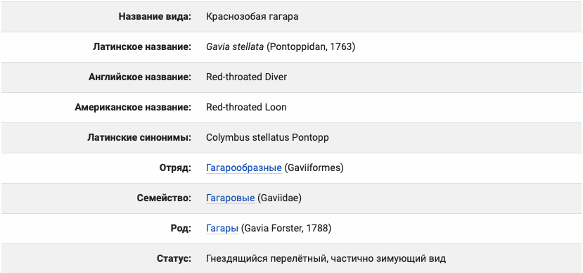
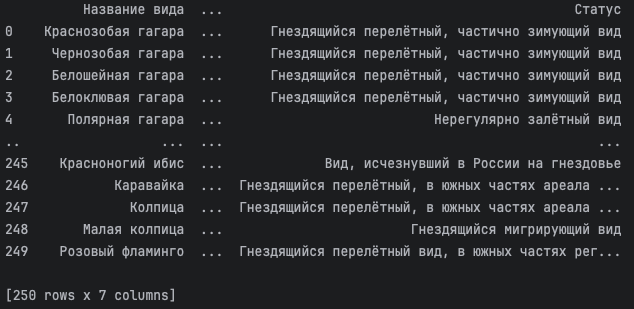
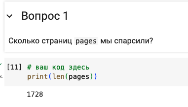
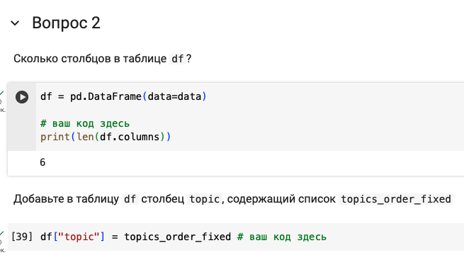
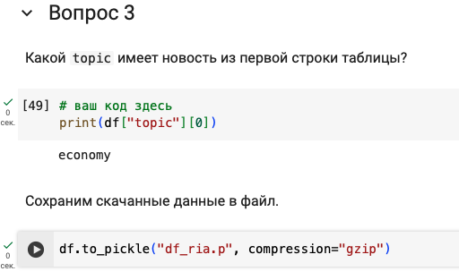
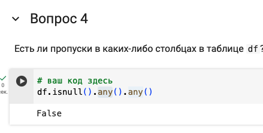

# parsing-data
Первая лабораторная по предмету "Анализ и обучения на больших данных"

## Парсинг данных о птицах с сайта egir.ru
### Структура сайта:
* Главная страница
  * Том 1
    * Птица 1
    * Птица 2 \
    ...
    * Птица N \
  ...
  * Том N
    * Птица 1
    * Птица 2 \
    ...
    * Птица N

Парсить будем таблицу с данными для каждой птицы \


 ### Алгоритм работы
Определяем класс Bird
```python
@dataclass
class Bird:
    name: str = None
    latinName: str = None
    engName: str = None
    group: str = None
    family: str = None
    race: str = None
    status: str = None

```
Инициализируем браузер через который мы будем загружать код страниц
```python
options = ChromiumOptions()
options.add_argument('--headless')

service = Service(executable_path='./chromedriver')

browser = webdriver.Chrome(options=options, service=service)
```
Переход на страницу по ссылке, получение списка томов через XPATH и ссылок на них 
```python
browser.get('https://www.egir.ru')
toms = browser.find_elements(By.XPATH, '/html/body/div[3]/div/div/div/div[1]/div/div/div/div/div/div[1]/h4/a')
tom_links = [x.get_attribute('href') for x in toms]
```
Далее, получив список томов происходит последовательный обход. В каждом томе через XPATH выбираются ссылки на птиц
```python
def parse_tom(tom_link, tom_num) -> DataFrame:
    print(f'Parsing tom {tom_num}')
    start = time.perf_counter()
    browser.get(tom_link)
    birds = browser.find_elements(By.XPATH, '/html/body/div[3]/div/div[1]/div/table/tbody/tr/td[1]/a')
    bird_links = [x.get_attribute('href') for x in birds]

    df = pd.DataFrame([parse_bird(bird_link) for bird_link in bird_links], columns=column_names)

    print(f"Completed parsing tom {tom_num}:  {time.perf_counter() - start:0.4f} sec.")
    return df
```
Аналогично для парсинга отдельной птицы
```python
def parse_bird(bird_link):
    bird = Bird()
    browser.get(bird_link)
    bird.name = get_cell_value(browser, fields_to_find[0])
    bird.latinName = get_cell_value(browser, fields_to_find[1])
    bird.engName = get_cell_value(browser, fields_to_find[2])
    bird.group = get_cell_value(browser, fields_to_find[3])
    bird.family = get_cell_value(browser, fields_to_find[4])
    bird.race = get_cell_value(browser, fields_to_find[5])
    bird.status = get_cell_value(browser, fields_to_find[6])
    return pd.Series([bird.name, bird.latinName, bird.engName, bird.group, bird.family, bird.race, bird.status],
                     index=column_names)
```
Для получения из таблицы значения по названию строки была написана функция-обертка. Она находит ячейку с необходимым именем и выбирает следующий элемент td.
```python
def get_cell_value(browser, row_name):
    try:
        return browser.find_element(By.XPATH, '//strong[contains(text(),\'' + row_name + ':\')]/../following-sibling::td').text
    except Exception:
        return ""

```
В итоге, аггрегируем результат в Dataframe и сохраняем 
```python
df = pd.concat([parse_tom(link, i) for i, link in enumerate(tom_links)], ignore_index=True)
df.to_pickle("df–egir.p", compression='gzip')
```
Результат парсинга \


### Ответы на вопросы




               